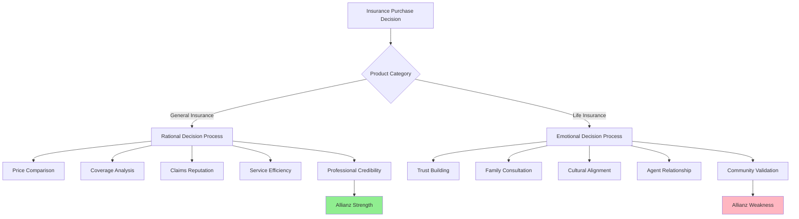
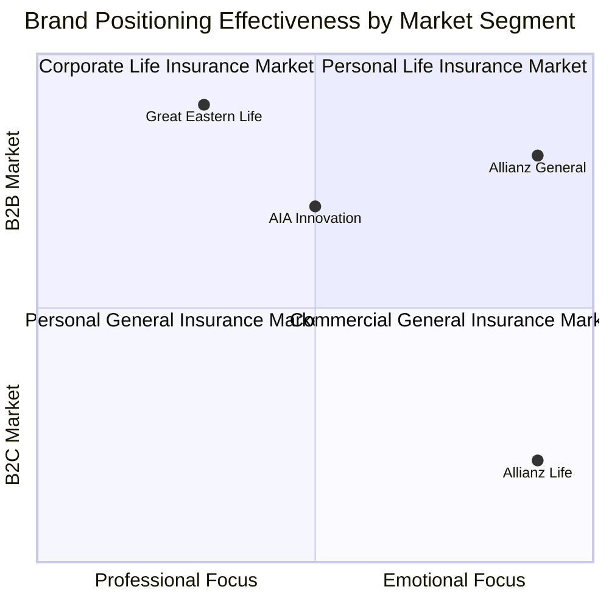
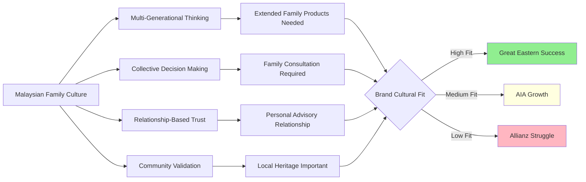
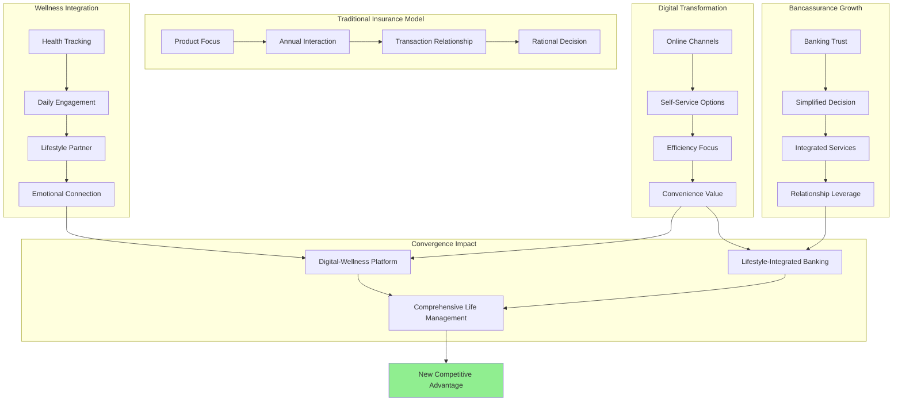
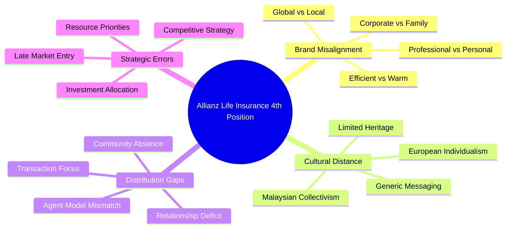
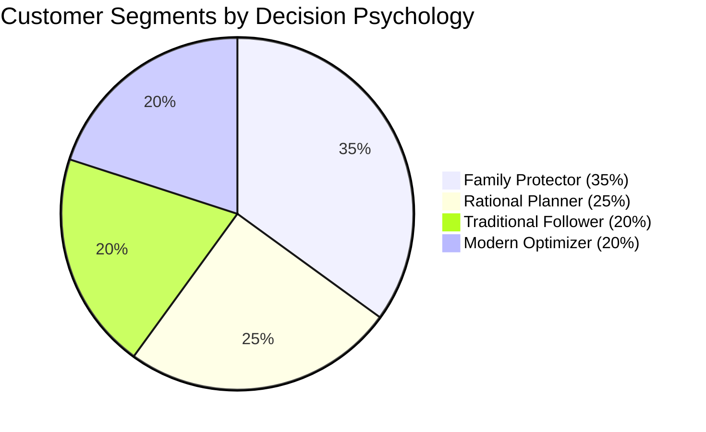
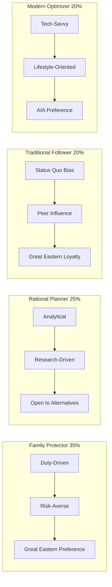
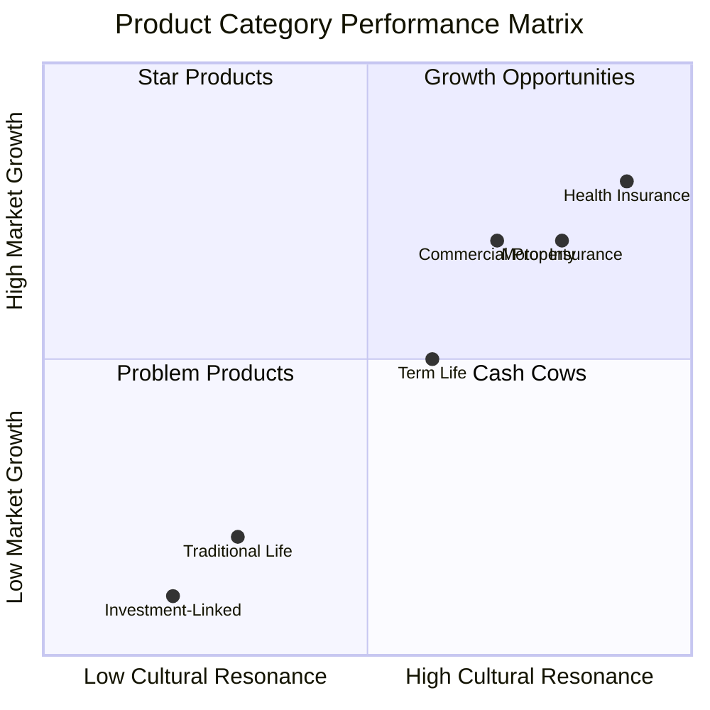
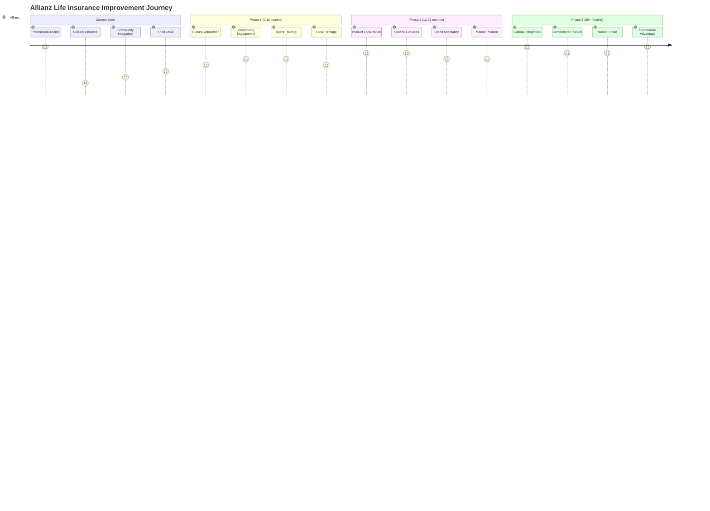

# Visual Insights Summary
## Malaysian Insurance Market Qualitative Research - Key Relationships and Dynamics

### Overview

This document presents visual representations of the key qualitative insights from the comprehensive Malaysian insurance market analysis, illustrating the relationships between customer behavior, brand positioning, and market dynamics.

---

## 1. Customer Decision Psychology Framework



## 2. Brand Positioning vs Market Requirements Matrix



## 3. Cultural Alignment Impact Chain



## 4. Market Trend Convergence Impact



## 5. Competitive Disadvantage Root Cause Analysis



## 6. Customer Segmentation by Insurance Psychology





## 7. Product Portfolio Resonance Mapping



## 8. Success Transformation Pathway



## 9. Risk-Return Assessment Matrix

```mermaid
quadrantChart
    title Strategy Options Risk-Return Analysis
    x-axis Low Risk --> High Risk
    y-axis Low Return --> High Return
    
    quadrant-1 High Return, Low Risk (Ideal)
    quadrant-2 High Return, High Risk (Strategic)
    quadrant-3 Low Return, Low Risk (Safe)
    quadrant-4 Low Return, High Risk (Avoid)
    
    Cultural Adaptation: [0.3, 0.8]
    Product Localization: [0.4, 0.7]
    Community Engagement: [0.2, 0.6]
    Brand Transformation: [0.8, 0.9]
    Direct Competition: [0.9, 0.3]
    Partnership Strategy: [0.5, 0.6]
    Niche Focus: [0.3, 0.5]
    Innovation Leadership: [0.7, 0.8]
```

## 10. Competitive Dynamics Evolution

```mermaid
gitgraph
    commit id: "Traditional Market (Pre-2010)"
    branch "Digital Transformation"
    checkout "Digital Transformation"
    commit id: "Online Channels"
    commit id: "Mobile Apps"
    commit id: "Digital-First Service"
    
    checkout main
    branch "Wellness Revolution"
    checkout "Wellness Revolution"
    commit id: "AIA Vitality Launch"
    commit id: "Health Integration"
    commit id: "Lifestyle Positioning"
    
    checkout main
    branch "Bancassurance Growth"
    checkout "Bancassurance Growth"
    commit id: "Bank Partnerships"
    commit id: "Integrated Services"
    commit id: "Trust Transfer"
    
    checkout main
    merge "Digital Transformation"
    merge "Wellness Revolution"
    merge "Bancassurance Growth"
    commit id: "Convergence Era (2024+)"
```

---

## Key Visual Insights Summary

### 1. Decision Psychology Divergence
The fundamental difference between rational general insurance decisions and emotional life insurance decisions explains Allianz's market position paradox.

### 2. Cultural Alignment Critical Path
Success in life insurance requires progression through cultural understanding, community integration, relationship building, and trust development.

### 3. Market Trend Convergence
Digital transformation, wellness integration, and bancassurance are converging to create new competitive dynamics favoring integrated lifestyle platforms.

### 4. Transformation Complexity
Moving from 4th to 3rd position requires coordinated improvements across multiple dimensions: cultural, relational, product, and service.

### 5. Risk-Return Trade-offs
Higher-impact strategies (brand transformation, innovation leadership) carry higher risks, while lower-risk approaches (cultural adaptation, community engagement) offer more certain but limited returns.

### 6. Competitive Evolution
The market is evolving from traditional product-focused competition to integrated lifestyle platform competition, requiring new capabilities and positioning.

---

## Strategic Implications

**Visual Analysis Confirms**:
1. **Multi-Dimensional Challenge**: Allianz faces interconnected challenges requiring coordinated response
2. **Cultural Priority**: Cultural adaptation emerges as highest priority, lowest risk improvement area
3. **Segment Strategy**: Different customer segments require different approaches and positioning
4. **Transformation Timeline**: Meaningful change requires 3+ year commitment with phased approach
5. **Competitive Dynamics**: Market evolution favors integrated lifestyle platforms over traditional insurance providers

**Visual Framework Applications**:
- **Strategic Planning**: Use journey mapping for transformation roadmap development
- **Investment Prioritization**: Apply risk-return matrix for resource allocation decisions
- **Performance Monitoring**: Track progress through cultural alignment and market position metrics
- **Stakeholder Communication**: Visual frameworks for explaining complex market dynamics and strategic rationale

---

**Visual Analysis Confidence**: 88%
**Methodology**: Systems thinking visualization, stakeholder journey mapping, competitive dynamics modeling
**Applications**: Strategic planning, investment prioritization, stakeholder communication, performance monitoring